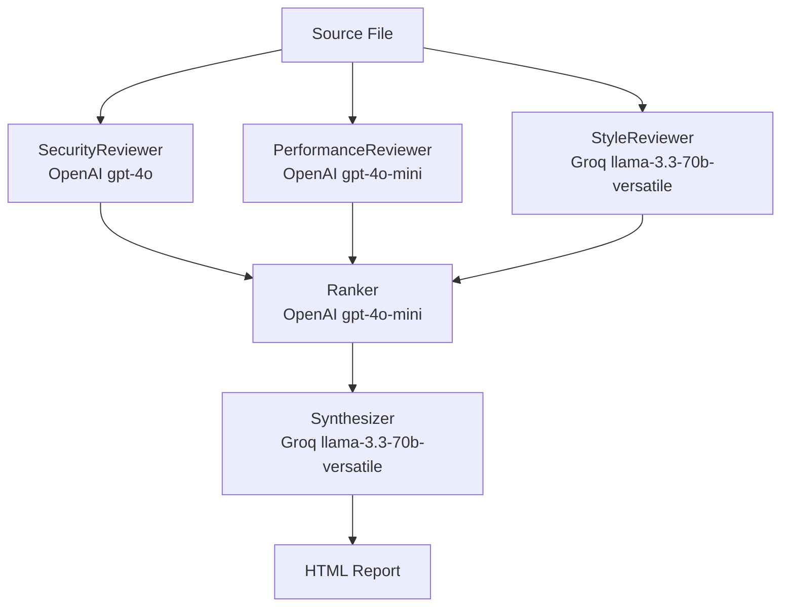

# langchain-gateway-node-demo

A multi-agent code review pipeline built with TypeScript, LangChain.js, and the Axemere Gateway. Three specialist reviewers run in parallel, a ranker cross-prioritizes findings across all dimensions, and a synthesizer produces an executive summary and action plan — all routed through the Axemere Gateway for unified metering and observability.

## Table of Contents

- [Overview](#overview)
- [Architecture](#architecture)
- [Prerequisites](#prerequisites)
- [Quickstart](#quickstart)
- [Makefile Targets](#makefile-targets)
- [What the Report Shows](#what-the-report-shows)
- [Documentation](#documentation)

## Overview

Five LangChain.js agents run in a coordinated pipeline against any source file:

| Agent | Role | Provider | Model |
|-------|------|----------|-------|
| SecurityReviewer | Vulnerability and risk analysis | OpenAI | gpt-4o |
| PerformanceReviewer | Bottleneck and inefficiency detection | OpenAI | gpt-4o-mini |
| StyleReviewer | Readability and convention checks | Groq | llama-3.3-70b-versatile |
| Ranker | Cross-dimension priority ranking | OpenAI | gpt-4o-mini |
| Synthesizer | Executive summary and action plan | Groq | llama-3.3-70b-versatile |

All calls are routed through the Axemere Gateway, which records every invocation with token counts, cost, latency, and a `run_id` label that ties all five records from one run together for filtering in the console or API.

**Live run result:** `examples/sample-vulnerable.ts` produced 19 raw findings across 3 dimensions, 12 ranked (3 critical, 3 high), total cost $0.02, wall-clock time 31s.

## Architecture



The three reviewer agents run concurrently via `Promise.all()`. Total wall-clock time equals the slowest reviewer, not the sum of all three. See [docs/architecture.md](docs/architecture.md) for a detailed breakdown of each phase.

## Prerequisites

- Node.js 20 or later
- An Axemere Gateway account — [console.axemere.ai](https://console.axemere.ai)
- A gateway token and project ID from the console
- OpenAI and Groq API keys provisioned in the gateway (not set in your local environment)

## Quickstart

```bash
git clone https://github.com/Axemere-LLC/langchain-gateway-node-demo.git
cd langchain-gateway-node-demo

make install

cp .env.example .env
# Edit .env: set AXEMERE_GATEWAY_TOKEN and AXEMERE_PROJECT_ID

make review
# Default target: examples/sample-vulnerable.ts
# Output: output/report.html

open output/report.html
```

To review a different file:

```bash
make review FILE=path/to/your/code.ts
```

## Makefile Targets

| Target | Description |
|--------|-------------|
| `make help` | Show all available targets |
| `make install` | Install npm dependencies |
| `make build` | Compile TypeScript to `dist/` |
| `make test` | Run unit tests with Vitest |
| `make lint` | Run ESLint and TypeScript type check |
| `make review` | Run the full pipeline on `FILE` (default: `examples/sample-vulnerable.ts`) |
| `make report` | Re-render the HTML report from the last `output/report.json` without LLM calls |
| `make clean` | Remove `dist/` and `output/` build artifacts |

## What the Report Shows

The HTML report contains:

- **Ranked findings** — all issues from all three reviewers, ordered by cross-dimension priority rank (rank 1 = most critical), with severity, category, line hint, and a concrete suggested fix
- **Executive summary** — 2–3 sentence overview written by the Synthesizer for a tech lead audience
- **Action plan** — ordered list of actions derived from the ranked findings
- **Risk assessment** — overall risk level and rationale
- **Metering table** — per-agent token counts (in/out), cost in USD, and latency; plus pipeline totals

## Documentation

| Document | Description |
|----------|-------------|
| [docs/architecture.md](docs/architecture.md) | Pipeline phases, data flow, metering, run_id label strategy |
| [docs/agents.md](docs/agents.md) | Each agent's purpose, model, workload ID, prompt strategy, and output schema |
| [docs/gateway-integration.md](docs/gateway-integration.md) | Gateway integration patterns, environment variables, known limitations |
| [docs/glossary.md](docs/glossary.md) | Domain term definitions |
