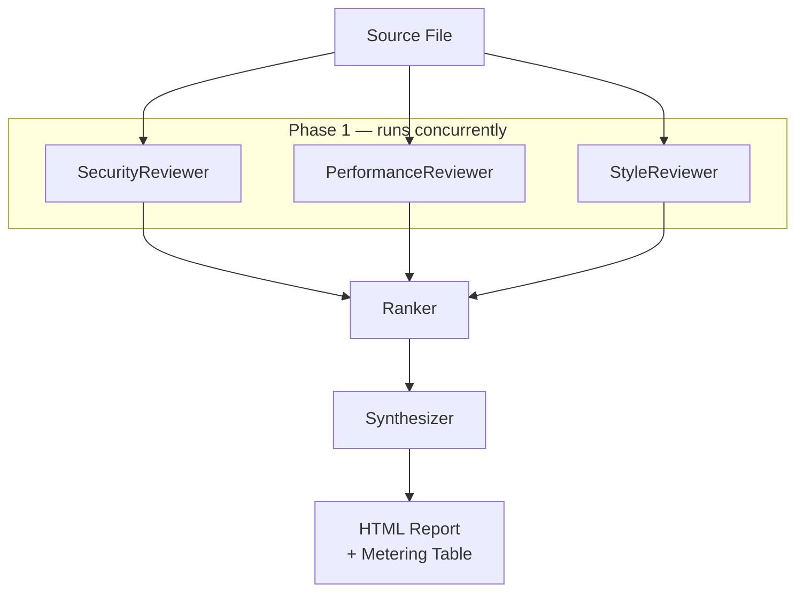

# Architecture

Pipeline design, data flow, and observability strategy for the multi-agent code review system.

Related: [agents.md](agents.md) | [gateway-integration.md](gateway-integration.md)

## Table of Contents

- [Overview](#overview)
- [Pipeline Phases](#pipeline-phases)
  - [Phase 1: Parallel Review](#phase-1-parallel-review)
  - [Phase 2: Rank](#phase-2-rank)
  - [Phase 3: Synthesize](#phase-3-synthesize)
- [Data Flow](#data-flow)
- [Component Diagram](#component-diagram)
- [Why Parallel Execution](#why-parallel-execution)
- [Metering](#metering)
- [Run ID Label Strategy](#run-id-label-strategy)

## Overview

The pipeline takes a source file as input and produces a ranked HTML report. Five LangChain.js agents execute in three sequential phases; within the first phase the agents run concurrently. All calls route through the Axemere [Gateway](glossary.md#gateway) using the [Explicit Mode](glossary.md#explicit-mode) integration pattern via the custom `ChatAiGateway` class.

## Pipeline Phases

### Phase 1: Parallel Review

Three specialist reviewer agents execute concurrently against the same source code via `Promise.all()`. Each agent routes to a different [provider](glossary.md#provider) through the Gateway:

| Agent | Provider | Model | Project ID env var |
|-------|----------|-------|---------------------|
| SecurityReviewer | openai | gpt-4o | `PROJECT_ID_SECURITY` |
| PerformanceReviewer | openai | gpt-4o-mini | `PROJECT_ID_PERFORMANCE` |
| StyleReviewer | groq | llama-3.3-70b-versatile | `PROJECT_ID_STYLE` |

Each agent produces a `ReviewOutput`: a list of [findings](glossary.md#findings) and a one-paragraph summary. At the end of Phase 1 the pipeline holds three independent `ReviewOutput` objects.

### Phase 2: Rank

The [Ranker](glossary.md#ranker) agent receives all findings from all three reviewers in a single prompt. It assigns a cross-dimension priority `rank` to each finding (rank 1 = most critical overall) and returns a `RankerOutput` containing the sorted list and a brief explanation of the ranking strategy applied.

The Ranker uses OpenAI `gpt-4o-mini`, attributed to project `PROJECT_ID_RANKER`.

### Phase 3: Synthesize

The Synthesizer agent receives the ranked findings and produces a `SynthesisOutput` containing:

- `executive_summary` — 2–3 sentences for a tech lead
- `action_items` — ordered list with priority labels
- `risk_assessment` — overall risk level and rationale

The Synthesizer uses Groq `llama-3.3-70b-versatile`, attributed to project `PROJECT_ID_SYNTHESIZER`.

## Data Flow



The `PipelineResult` type carries all intermediate outputs (`security`, `performance`, `style`, `ranked`, `synthesis`) along with aggregated [metering](glossary.md#metering) for all five agents.

## Component Diagram

```mermaid
flowchart TD
    CLI[CLI / index.ts]
    CLI --> Pipeline[pipeline.ts<br>runPipeline]
    Pipeline --> Config[config.ts<br>AGENT_CONFIGS<br>projectIdFor]
    Pipeline --> LLM[llm.ts<br>ChatAiGateway]
    LLM --> SDK[@axemere/gateway<br>AiGatewayClient]
    SDK --> GW[Axemere Gateway]
    GW --> OpenAI[OpenAI]
    GW --> Groq[Groq]
    Pipeline --> Agents[agents/<br>security · performance<br>style · ranker · synthesizer]
    Agents --> Types[types.ts<br>Zod schemas]
    Pipeline --> Report[report/<br>html.ts]
```

## Why Parallel Execution

Running the three reviewers sequentially would take approximately three times as long. `Promise.all()` fires all three requests simultaneously; the Phase 1 wall-clock time equals the slowest individual reviewer, not the sum.

```
Sequential:  security (12s) + performance (8s) + style (9s) = 29s
Parallel:    max(12s, 8s, 9s)                               = 12s
```

Each reviewer gets its own `ChatAiGateway` instance, so metering state is not shared between concurrent calls. The Gateway records each call independently and assigns it a unique [Record ID](glossary.md#record-id).

The alternative — LangChain's `RunnableParallel` — is functionally equivalent. `Promise.all()` is used here for transparency: metering capture is explicit and visible in `pipeline.ts` without requiring knowledge of LangChain's internals.

## Metering

Every call through `ChatAiGateway` returns a [Metering](glossary.md#metering) object alongside the response content. After each `Promise.all()` or sequential call resolves, `pipeline.ts` captures the metering from each `ChatAiGateway` instance via its `lastMetering`, `lastRecordId`, `lastProvider`, and `lastModel` fields.

These are "side-channel" fields on the class instance — safe here because each agent owns exactly one `ChatAiGateway` instance and calls it exactly once per run.

The `AgentMetering` type records:

| Field | Description |
|-------|-------------|
| `agent` | Agent name (e.g., `security`) |
| `provider` | Actual provider used (from gateway response) |
| `model` | Actual model used (from gateway response) |
| `record_id` | Gateway [Record ID](glossary.md#record-id) for this call |
| `tokens_in` | Prompt token count |
| `tokens_out` | Completion token count |
| `cost_usd` | Estimated cost in USD |
| `latency_ms` | Wall-clock time for this agent's call |

The `PipelineResult` also aggregates `total_cost_usd`, `total_tokens_in`, `total_tokens_out`, and `elapsed_ms` across all five agents.

See [docs/gateway-integration.md](gateway-integration.md) for how metering is surfaced by the `AiGatewayClient`.

## Run ID Label Strategy

At the start of each `runPipeline()` call, a 14-character local-time [run ID](glossary.md#run-id) is generated:

```typescript
const runId = newRunId(); // "20260818145233" — YYYYMMDDHHMMSS, local time
```

This value also names the output directory (`output/<run_id>/`), so a run's report, JSON result, and gateway records all share the same identifier.

Every `ChatAiGateway` instance created for that run receives this ID as a gateway label alongside an `agent` label:

```typescript
labels: { run_id: runId, agent: agentName }
```

This means all five gateway records produced by one pipeline run share the same `run_id` value. They can be retrieved together in the Axemere console using the label filter:

```
https://console.axemere.ai/records?label_key=run_id&label_value=<run_id>
```

The `label_key` / `label_value` query params work for any label you attach — `run_id` is just a convention used by this demo. The HTML report makes this concrete: the run ID in the report header is a direct link to the console pre-filtered to that run's records.

The run ID also appears in every `console.log` line during the run, so logs and gateway records can be correlated without additional instrumentation.

See the [example report](https://axemere-llc.github.io/langchain-gateway-node-demo/examples/sample-vulnerable/report.html) for a live demonstration of the run ID link.

See [agents.md](agents.md) for the full list of workload IDs per agent.
